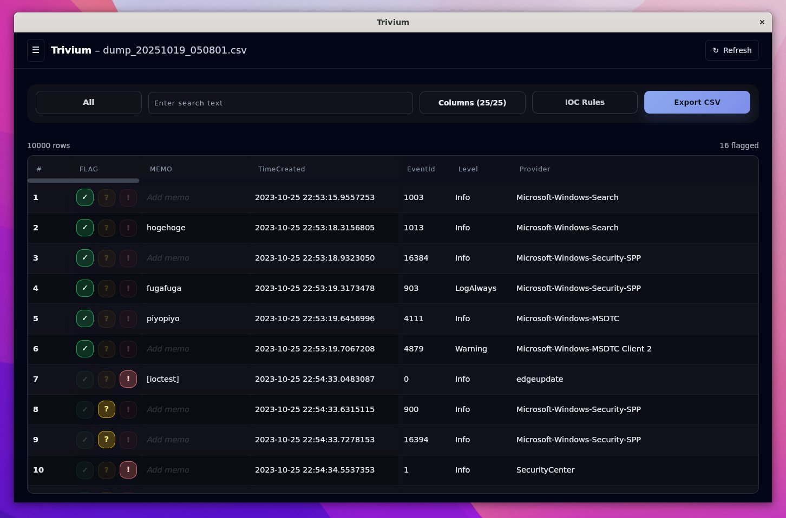

# Trivium

A desktop application for analyzing CSV data with flagging, memo annotation, and IOC rule matching. Built with Tauri (Rust backend) and Svelte (frontend).



## Features

- **CSV Import**: Import CSV files and convert to Parquet for fast processing
- **Flag System**: Mark rows as Safe (✓), Suspicious (?), or Critical (!)
- **Memo Annotation**: Add notes to individual rows
- **IOC Rules**: Define rules to automatically flag rows based on content matching
- **Column Management**: Show/hide columns per project
- **Filtering**: Filter by flag status, search text, or visible columns
- **Export**: Export filtered data with flags and memos to CSV

## Technology Stack

- **Backend**: Rust with Tauri framework
- **Data Processing**: Polars for CSV/Parquet operations
- **Frontend**: Svelte with TypeScript
- **UI**: Tailwind CSS
- **Storage**: JSON files for metadata, Parquet for data

## Development

### Prerequisites

- Node.js 18+
- Rust toolchain (install via rustup)

### Setup

```bash
npm install
npm run tauri dev
```

### Build Commands

```bash
npm run dev          # UI development only
npm run tauri dev    # Full desktop app with hot reload
npm run build        # Build UI bundle
npm run tauri build  # Build distributable binary
npm run lint         # Type checking
```

## Project Structure

- `src/` - Svelte frontend components
- `src-tauri/src/` - Rust backend with Tauri commands
- `src-tauri/Cargo.toml` - Rust dependencies including Polars
- `package.json` - Node.js dependencies and scripts

## Data Storage

Projects are stored in the OS-specific app data directory:
- `trivium/projects/<uuid>/data.parquet` - Converted CSV data
- `trivium/projects/<uuid>/flags.json` - Row flags and memos
- `trivium/projects/<uuid>/iocs.json` - IOC rules
- `trivium/projects.json` - Project metadata

## License

MIT License - see [LICENSE](LICENSE).