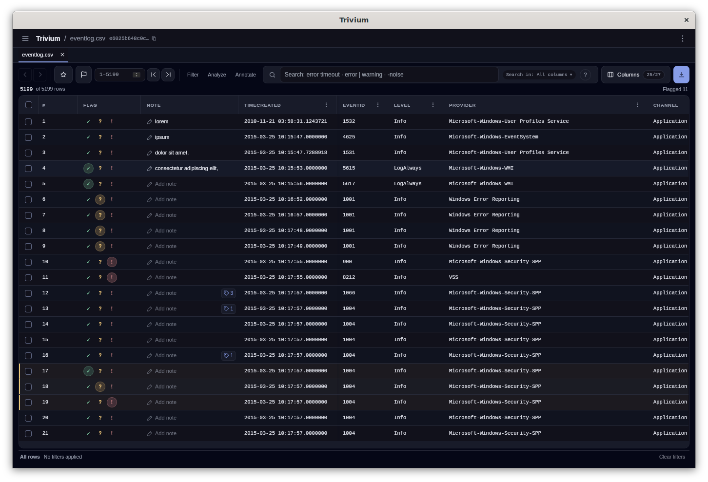
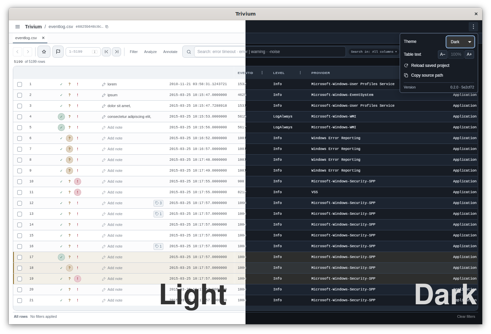
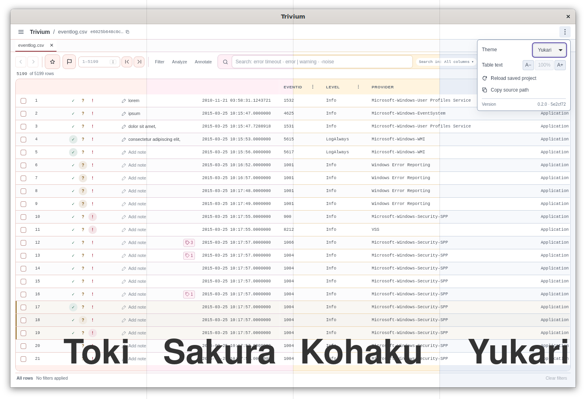
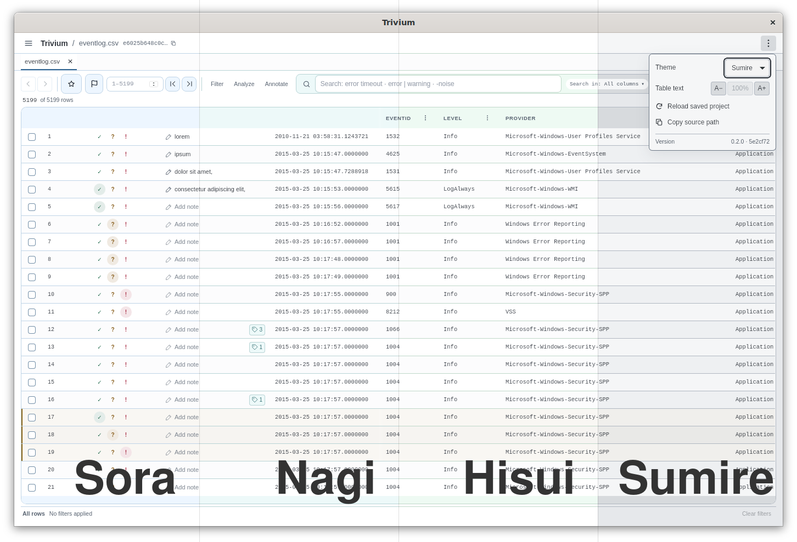
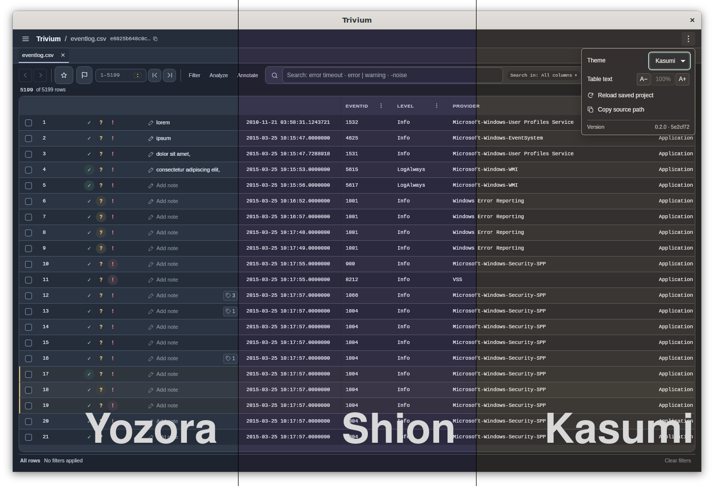
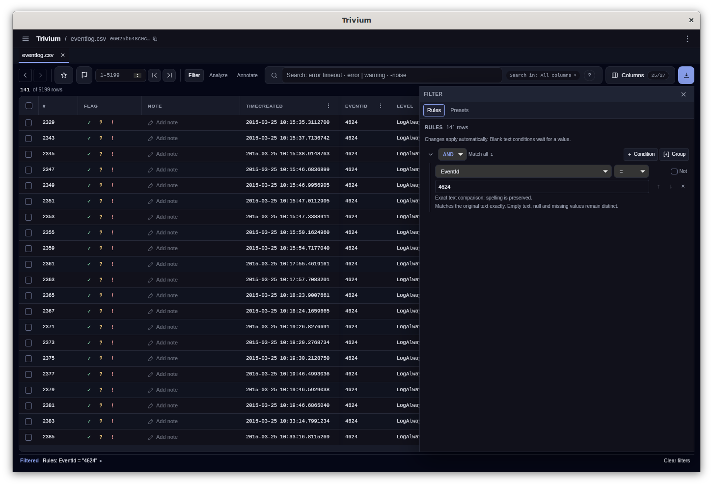
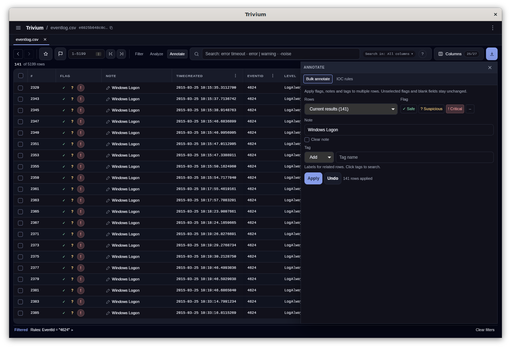
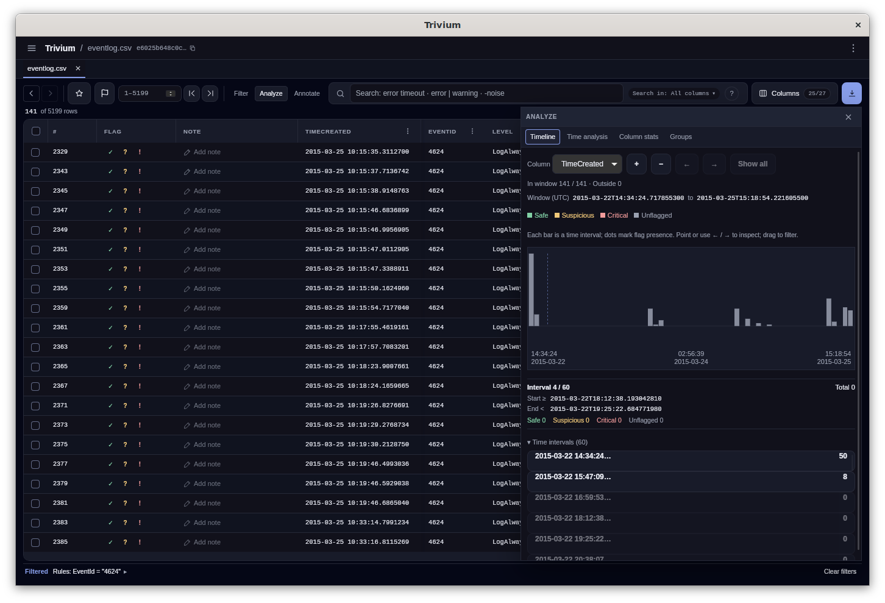

# Trivium

**"For the trivial bits of log analysis."**

## Introduction

**Trivium** is a desktop application for searching, analyzing, and investigating logs in CSV and JSON formats.

Designed with incident response in mind, it provides search, filtering, flags, annotations, timeline analysis, IOC management, and other tools for working through log data.

The separate `trivium-cli` executable provides an automation interface for scripts and LLM-assisted investigations. See the [Python example](examples/automate.py) to get started. Let's spend as little time as possible on the trivial stuff.

## Themes

Choose from a variety of color themes to suit your preferences.

## Features

### Log Viewer

View CSV, JSON, JSONL, and NDJSON logs in a table, including nested JSON records. Click a cell to inspect the full record without having to scroll across all its columns.

You can open multiple files in tabs, reorder and resize columns, hide columns you don't need, and pin important columns in place.

### Search & Filter

Search for keywords, limit searches to specific columns, or build more complex conditions using AND, OR, and NOT. Use the back and forward buttons to revisit previous filter rules.

Save filter rules, column layouts, and sort order as presets to reuse them across files with matching columns.

### Search Syntax

Text search is intended for quickly narrowing down the data. It is case-insensitive and does not support parentheses for grouping or regular expressions. For regular expressions, numeric or datetime comparisons, and more complex AND/OR conditions, use **Filter → Rules**.

| Example | Description |
| --- | --- |
| `powershell` | Find rows containing the specified text |
| `error timeout` | Find rows containing both terms (AND) |
| `error\|warn` | Find rows containing either term (OR) |
| `-test` | Exclude rows containing `test` (NOT) |
| `EventID:4624` | Find rows containing `4624` in the `EventID` column |
| `"powershell -enc"` | Search for an exact phrase |
| `@tag:review` | Find rows tagged with `review` |
| `@tag:*` | Find rows with any tag |

### Flag & Annotate

Assign one of three flags to rows as you investigate:

- **Safe** — Rows you have determined to be harmless
- **Suspicious** — Rows that may warrant further investigation
- **Critical** — Rows you have identified as significant or problematic

You can also add notes, tags, and bookmarks to individual rows. Use **Annotate → Bulk annotate** to apply flags, notes, or tags to selected rows, the current results, or all rows. You can undo the most recent bulk operation.

### Timeline & Analysis

For logs with a datetime column, the timeline visualizes when events occurred, including the number of events and their breakdown into Safe, Suspicious, Critical, and unflagged rows.

Zoom in on periods of high activity or select a time range to narrow down the table. Column value counts, uncommon values, time gaps, and grouping tools also help you investigate the data in more detail.

### Save & Export

Trivium automatically saves each investigation as a local project, including your filters and annotations. Closing a tab keeps the project; reopen it from **Projects** to continue your investigation.

Export **all rows, the current results, or selected rows** to CSV. You can also include flags, notes, tags, and bookmarks in the exported data.

## Installation

Prebuilt binaries are available for **Windows (x64)** and **Linux (x64)**:

- **Windows:** Portable `.exe` in a ZIP archive
- **Linux:** `.deb` package or `AppImage` in a ZIP archive

Download the latest version for your platform from [GitHub Releases](https://github.com/sumeshi/trivium/releases).

The Windows version requires [Microsoft Edge WebView2 Runtime](https://developer.microsoft.com/en-us/microsoft-edge/webview2/). Please install it beforehand if it is not already available.

## Feedback

Bug reports and feature requests are welcome in [GitHub Issues](https://github.com/sumeshi/trivium/issues).

## License

Trivium is released under the [MIT License](LICENSE).

## Third-party Licenses

Trivium includes third-party open-source software, which is distributed under its respective licenses.

Copyright notices and license terms for third-party components are provided in `THIRD_PARTY_LICENSES.txt`, included with each binary distribution.

## Acknowledgments

Trivium was inspired by Eric Zimmerman's [Timeline Explorer](https://ericzimmerman.github.io/). Many thanks to him for his excellent work.
